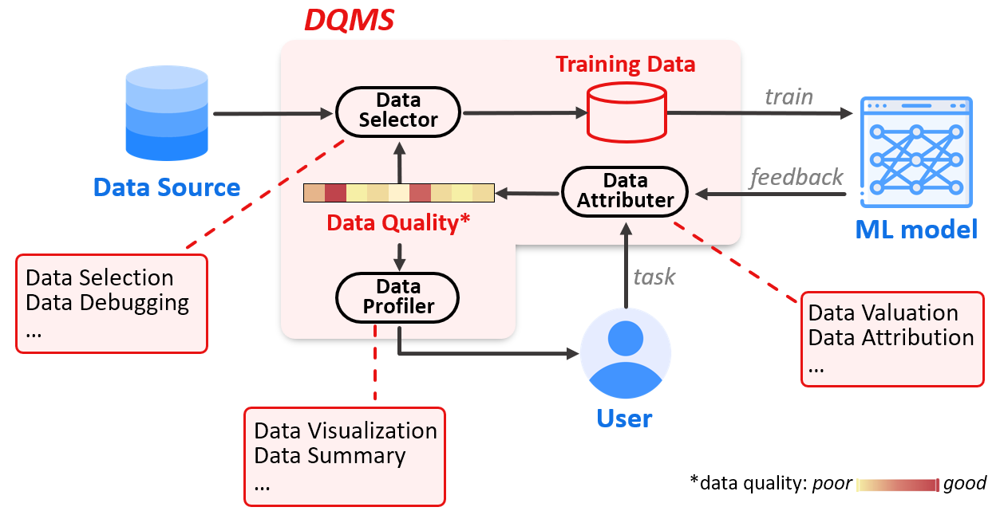

# Awesome ML Data Quality Papers

This is a list of papers about training data quality management for ML models. 

## Introduction

Data scientists spend ∼80% time on data preparation for an ML pipeline since the data quality issues are unknown beforehand thereby leading to iterative debugging. A good Data Quality Management System for ML (**DQMS for ML**) helps data scientists break free from the arduous process of data selection and debugging, particularly in the current era of big data and large models. Automating the management of training data quality effectively is crucial for improving the efficiency and quality of ML pipelines.

With the emergence and development of "**Data-Centric AI**", there has been increasing research focus on optimizing the quality of training data rather than solely concentrating on model structures and training strategies. This is the motivation behind maintaining this repository.

Before we proceed, let's define **data quality for ML**. In contrast to traditional data cleaning, training data quality for ML refers to the impact of individual or groups of data samples on the behavior of ML models for a given task. It's important to note that the behavior of the model we are concerned with goes beyond performance metrics like accuracy, recall, AUC, MSE, etc. We also consider more generalizable metrics such as model fairness, robustness, and so on.

Considering the following pipeline, DQMS acts as a **middleware** between data, ML model, and user, necessitating interactions with each of them.

A DQMS for ML typically consists of three components: **Data Selector**, **Data Attributer**, and **Data Profiler**. To achieve a well-performing ML model, multiple rounds of training are often required. In this process, the DQMS needs to iteratively adjust the training data based on the results of each round of model training. The workflow of DQMS in one round of training is as follows: (a) Data Selector first acquires the training dataset from a data source and trains the ML model with it. (b) After training for one round (several epochs), Data Attributer absorbs feedback from the model and user's task requirements and computes the data quality assessment. (c) Data Profiler then provides a user-friendly summary of the training data. (d) Meanwhile, Data Selector utilizes the data quality assessment as feedback to acquire higher-quality training data, thus initiating a new iteration.

We collect the recent influential papers about DQMS for ML and annotate the relevant DQMS components involved in these papers, where `DS` = Data Selector, `DA` = Data Attributer, and `DP` = Data Profiler.

## Paper List

### 2024

- [ICLR 24] "What Data Benefits My Classifier?" Enhancing Model Performance and Interpretability through Influence-Based Data Selection [[paper](https://openreview.net/pdf?id=HE9eUQlAvo)] [[code](https://github.com/anshuman23/InfDataSel)] `DS` `DA`
- [ICLR 24] Canonpipe: Data Debugging with Shapley Importance over Machine Learning Pipelines [[paper](https://openreview.net/pdf?id=qxGXjWxabq)] [[code](https://github.com/easeml/datascope)] `DA`
- [ICLR 24] Candidate Label Set Pruning: A Data-centric Perspective for Deep Partial-label Learning [[paper](https://openreview.net/pdf?id=Fk5IzauJ7F)] `DS` `DA`
- [ICLR 24] Time Travel in LLMs: Tracing Data Contamination in Large Language Models [[paper](https://openreview.net/pdf?id=2Rwq6c3tvr)] [[code](https://github.com/shahriargolchin/time-travel-in-llms)] `DA`
- [ICLR 24] GIO: Gradient Information Optimization for Training Dataset Selection [[paper](https://openreview.net/pdf?id=3NnfJnbJT2)] `DS`
- [ICLR 24] Real-Fake: Effective Training Data Synthesis Through Distribution Matching [[paper](https://openreview.net/pdf?id=svIdLLZpsA)] [[code](https://github.com/BAAI-DCAI/Training-Data-Synthesis)] `DS`
- [ICLR 24] Intriguing Properties of Data Attribution on Diffusion Models [[paper](https://openreview.net/pdf?id=vKViCoKGcB)] [[code](https://github.com/sail-sg/D-TRAK)] `DA`
- [ICLR 24] D2 Pruning: Message Passing for Balancing Diversity and Difficulty in Data Pruning [[paper](https://openreview.net/pdf?id=thbtoAkCe9)] [[code](https://github.com/adymaharana/d2pruning)] `DS`
- [ICLR 24] Effective pruning of web-scale datasets based on complexity of concept clusters [[paper](https://openreview.net/pdf?id=CtOA9aN8fr)] [[code](https://github.com/amro-kamal/effective_pruning)] `DS`
- [ICLR 24] Towards a statistical theory of data selection under weak supervision [[paper](https://openreview.net/pdf?id=HhfcNgQn6p)] `DS`
- [ICLR 24] Get more for less: Principled Data Selection for Warming Up Fine-Tuning in LLMs [[paper](https://openreview.net/pdf?id=QmYNBVukex)] [[code](https://anonymous.4open.science/r/DV4LLM-D761/)] `DS`
- [ICLR 24] DataInf: Efficiently Estimating Data Influence in LoRA-tuned LLMs and Diffusion Models [[paper](https://openreview.net/pdf?id=9m02ib92Wz)] [[code](https://github.com/ykwon0407/DataInf)] `DA`
- [ICLR 24] What Makes Good Data for Alignment? A Comprehensive Study of Automatic Data Selection in Instruction Tuning [[paper](https://openreview.net/pdf?id=BTKAeLqLMw)] `DS`

### 2023

- [NIPS 23] Data Selection for Language Models via Importance Resampling [[paper](https://openreview.net/pdf?id=uPSQv0leAu)] [[code](https://github.com/p-lambda/dsir)] `DS` `DA`
- [NIPS 23] Sample based Explanations via Generalized Representers [[paper](https://openreview.net/pdf?id=fX64q0SNfL)] `DA`
- [NIPS 23] Model Shapley: Equitable Model Valuation with Black-box Access[[paper](https://openreview.net/pdf?id=Y6IGTNMdLT)] [[code](https://github.com/XinyiYS/ModelShapley)] `DA`
- [NIPS 23] Threshold KNN-Shapley: A Linear-Time and Privacy-Friendly Approach to Data Valuation [[paper](https://openreview.net/pdf?id=FAZ3i0hvm0)] `DA`
- [NIPS 23] GEX: A flexible method for approximating influence via Geometric Ensemble [[paper](https://openreview.net/attachment?id=tz4ECtAu8e&name=pdf)] [[code](https://github.com/sungyubkim/gex)] `DA`
- [NIPS 23] Efficient Data Subset Selection to Generalize Training Across Models: Transductive and Inductive Networks [[paper](https://proceedings.neurips.cc/paper_files/paper/2023/file/0f25eb6e9dc26c933a5d7516abf1eb8c-Paper-Conference.pdf)] [[code](https://github.com/structlearning/subselnet)] `DS`
- [NIPS 23] Data Pruning via Moving-one-Sample-out [[paper](https://proceedings.neurips.cc/paper_files/paper/2023/file/3abe23bf7e295b44369c24465d68987a-Paper-Conference.pdf)] `DS`
- [NIPS 23] Towards Free Data Selection with General-Purpose Models [[paper](https://proceedings.neurips.cc/paper_files/paper/2023/file/047682108c3b053c61ad2da5a6057b4e-Paper-Conference.pdf)] [[code](https://github.com/yichen928/FreeSel)] `DS`
- [NIPS 23] Towards Accelerated Model Training via Bayesian Data Selection [[paper](https://proceedings.neurips.cc/paper_files/paper/2023/file/1af3e0bf5905e33789979f666c31192d-Paper-Conference.pdf)] `DS`
- [NIPS 23] Robust Data Valuation with Weighted Banzhaf Values [[paper](https://proceedings.neurips.cc/paper_files/paper/2023/file/bdb0596d13cfccf2db6f0cc5280d2a3f-Paper-Conference.pdf)] `DA`
- [NIPS 23] UP-DP: Unsupervised Prompt Learning for Data Pre-Selection with Vision-Language Models [[paper](https://proceedings.neurips.cc/paper_files/paper/2023/file/06d5f1fe6509b001e6d4e0ec1afd83dd-Paper-Conference.pdf)] `DS`
- [NIPS 23] Performance Scaling via Optimal Transport: Enabling Data Selection from Partially Revealed Sources [[paper](https://proceedings.neurips.cc/paper_files/paper/2023/file/c142c14699223f7417cad706fd6f652e-Paper-Conference.pdf)] [[code](https://github.com/ruoxi-jia-group/projektor)] `DS`
- [NIPS 23] Robust Data Pruning under Label Noise via Maximizing Re-labeling Accuracy [[paper](https://proceedings.neurips.cc/paper_files/paper/2023/file/ebb6bee50913ba7e1efeb91a1d47a002-Paper-Conference.pdf)] [[code](https://github.com/kaist-dmlab/Prune4Rel)] `DS`
- [NIPS 23] Spuriosity Rankings: Sorting Data to Measure and Mitigate Biases [[paper](https://proceedings.neurips.cc/paper_files/paper/2023/file/81cca94f16f20d5548c76c3344b27dea-Paper-Conference.pdf)] `DS`
- [NIPS 23] Core-sets for Fair and Diverse Data Summarization [[paper](https://proceedings.neurips.cc/paper_files/paper/2023/file/f980ba94f513168f2b292f58aef929ec-Paper-Conference.pdf)] [[code](https://github.com/microsoft/coresets-fair-diverse)] `DS` `DP`
- [NIPS 23] Retaining Beneficial Information from Detrimental Data for Neural Network Repair [[paper](https://proceedings.neurips.cc/paper_files/paper/2023/file/964b1c8dd5667fd647c09c8772829fd1-Paper-Conference.pdf)] `DS`
- [NIPS 23] Expanding Small-Scale Datasets with Guided Imagination [[paper](https://proceedings.neurips.cc/paper_files/paper/2023/file/f188a55392d3a7509b0b27f8d24364bb-Paper-Conference.pdf)] [[code](https://github.com/Vanint/DatasetExpansion)] `DS`
- [NIPS 23] Error Discovery By Clustering Influence Embeddings [[paper](https://openreview.net/pdf?id=yBVLXvJ1sb)] [[code](https://github.com/adebayoj/infembed)] `DA`
- [NIPS 23] HiBug: On Human-Interpretable Model Debug [[paper](https://proceedings.neurips.cc/paper_files/paper/2023/file/0f53ecc0d36a5d5d3d3e94d42c4b23ca-Paper-Conference.pdf)] [[code](https://github.com/cure-lab/HiBug)] `DP` `DS`
- [ICML 23] Discover and Cure: Concept-aware Mitigation of Spurious Correlation [[paper](https://openreview.net/pdf?id=QDxtrlPmfB)] [[code](https://github.com/Wuyxin/DISC)] `DS` `DA`
- [ICML 23] Data-OOB: Out-of-bag Estimate as a Simple and Efficient Data Value [[paper](https://proceedings.mlr.press/v202/kwon23e/kwon23e.pdf)] [[code](https://github.com/ykwon0407/dataoob)] `DA`
- [ICML 23] Towards Sustainable Learning: Coresets for Data-efficient Deep Learning [[paper](https://proceedings.mlr.press/v202/yang23g/yang23g.pdf)] [[code](https://github.com/bigml-cs-ucla/crest)] `DS`
- [ICLR 23] Data Valuation Without Training of a Model [[paper](https://openreview.net/pdf?id=XIzO8zr-WbM)] [[code](https://github.com/JJchy/CG_score)] `DA`
- [ICLR 23] Distilling Model Failures as Directions in Latent Space [[paper](https://openreview.net/pdf?id=99RpBVpLiX)] [[code](https://github.com/MadryLab/failure-directions)] `DS` `DP`
- [ICLR 23] LAVA: Data Valuation without Pre-Specified Learning Algorithms [[paper](https://openreview.net/pdf?id=JJuP86nBl4q)] [code](https://github.com/ruoxi-jia-group/LAVA)] `DA`
- [ICLR 23] Concept-level Debugging of Part-Prototype Networks [[paper](https://openreview.net/pdf?id=oiwXWPDTyNk)] [[code](https://github.com/abonte/protopdebug)] `DP`
- [ICLR 23] Dataset Pruning: Reducing Training Data by Examining Generalization Influence [[paper](https://openreview.net/pdf?id=4wZiAXD29TQ)] `DS`
- [ICLR 23] Moderate Coreset: A Universal Method of Data Selection for Real-world Data-efficient Deep Learning [[paper](https://openreview.net/pdf?id=7D5EECbOaf9)] [[code](https://github.com/tmllab/Moderate-DS)] `DS`
- [ICLR 23] Learning to Estimate Shapley Values with Vision Transformers [[paper](https://openreview.net/pdf?id=5ktFNz_pJLK)] [[code](https://github.com/suinleelab/vit-shapley)] `DA`
- [ICLR 23] Characterizing the Influence of Graph Elements [[paper](https://openreview.net/pdf?id=51GXyzOKOp)] [[code](https://github.com/Cyrus9721/Characterizing_graph_influence)] `DA`
- [VLDB 23] Equitable Data Valuation Meets the Right to Be Forgotten in Model Markets [[paper](https://www.vldb.org/pvldb/vol16/p3349-liu.pdf)] [[code](https://github.com/ZJU-DIVER/ValuationMeetsRTBF)] `DA`
- [VLDB 23] Computing Rule-Based Explanations by Leveraging Counterfactuals [[paper](https://www.vldb.org/pvldb/vol16/p420-geng.pdf)] [[code](https://github.com/GibbsG/GeneticCF)] `DP`
- [VLDB 23] Data Collection and Quality Challenges for Deep Learning [[paper](https://www.vldb.org/pvldb/vol13/p3429-whang.pdf)] `DS` `DA`
- [SIGMOD 23] HybridPipe: Combining Human-generated and Machine-generated Pipelines for Data Preparation [[paper](https://dbgroup.cs.tsinghua.edu.cn/ligl/papers/haipipe-acm.pdf)] [[code](https://github.com/ruc-datalab/Haipipe)] `DS` `DP`
- [SIGMOD 23] XInsight: eXplainable Data Analysis Through The Lens of Causality [[paper](https://arxiv.org/pdf/2207.12718.pdf)] `DP` 
- [SIGMOD 23] GoodCore: Coreset Selection over Incomplete Data for Data-effective and Data-efficient Machine Learning [[paper](https://dl.acm.org/doi/pdf/10.1145/3589302)] `DS`
- [ICDE 23] Automatic Feasibility Study via Data Quality Analysis for ML: A Case-Study on Label Noise [[paper](https://arxiv.org/pdf/2010.08410.pdf)] [[code](https://github.com/easeml/snoopy)] `DP`
- [AISTATS 23] Data Banzhaf: A Robust Data Valuation Framework for Machine Learning [[paper](https://proceedings.mlr.press/v206/wang23e/wang23e.pdf)] `DA`

### 2022

- [NIPS 22] CS-SHAPLEY: Class-wise Shapley Values for Data Valuation in Classification [[paper](https://openreview.net/pdf?id=KTOcrOR5mQ9)] [[code](https://github.com/stephanieschoch/cs-shapley)] `DA`
- [NIPS 22] Beyond neural scaling laws: beating power law scaling via data pruning [[paper](https://openreview.net/pdf?id=UmvSlP-PyV)] `DS`
- [ICML 22] Measuring the Effect of Training Data on Deep Learning Predictions via Randomized Experiments [[paper](https://proceedings.mlr.press/v162/lin22h/lin22h.pdf)] `DA`
- [ICML 22] Meaningfully Debugging Model Mistakes using Conceptual Counterfactual Explanations [[papeer](https://proceedings.mlr.press/v162/abid22a/abid22a.pdf)] [[code](https://github.com/mertyg/debug-mistakes-cce)] `DS` `DP`
- [ICML 22] Datamodels: Predicting Predictions from Training Data [[paper](https://proceedings.mlr.press/v162/ilyas22a/ilyas22a.pdf)] [[code](https://github.com/MadryLab/datamodels-data)] `DA`
- [ICML 22] Prioritized Training on Points that are learnable, Worth Learning, and Not Yet Learnt [[paper](https://proceedings.mlr.press/v162/mindermann22a/mindermann22a.pdf)] [[code](https://github.com/OATML/RHO-Loss)] `DS`
- [ICLR 22] Domino: Discovering systematic errors with cross-modal embeddings [[paper](https://openreview.net/pdf?id=FPCMqjI0jXN)] [[code](https://github.com/HazyResearch/domino)] `DA` `DP`
- [SIGMOD 22] Complaint-Driven Training Data Debugging at Interactive Speeds [[paper](https://dl.acm.org/doi/pdf/10.1145/3514221.3517849)] `DA`
- [SIGMOD 22] Interpretable Data-Based Explanations for Fairness Debugging [[paper](https://arxiv.org/pdf/2112.09745.pdf)] [[video](https://www.youtube.com/watch?v=bt_VL1eSu30)] `DA` `DP`
- [AAAI 22] Scaling Up Influence Functions [[paper](https://arxiv.org/pdf/2112.03052.pdf)] [[code](https://github.com/google-research/jax-influence)] `DA`
- [AISTATS 22] Beta Shapley: a Unified and Noise-reduced Data Valuation Framework for Machine Learning [[paper](https://proceedings.mlr.press/v151/kwon22a/kwon22a.pdf)] [code](https://github.com/ykwon0407/beta_shapley)] `DA`

### 2021 and before

- [NIPS 21] Explaining Latent Representations with a Corpus of Examples [[paper](https://proceedings.neurips.cc/paper/2021/file/65658fde58ab3c2b6e5132a39fae7cb9-Paper.pdf)] [[code](https://github.com/JonathanCrabbe/Simplex)] `DA`
- [NIPS 21] Deep Learning on a Data Diet: Finding Important Examples Early in Training [[paper](https://openreview.net/pdf?id=Uj7pF-D-YvT)] `DS`
- [NIPS 21] Interactive Label Cleaning with Example-based Explanations [[paper](https://proceedings.neurips.cc/paper/2021/file/6c349155b122aa8ad5c877007e05f24f-Paper.pdf)] [[code](https://github.com/abonte/cincer)] `DP`
- [ICML 21] GRAD-MATCH: Gradient Matching based Data Subset Selection for Efficient Deep Model Training [[paper](https://proceedings.mlr.press/v139/killamsetty21a/killamsetty21a.pdf)] [[code](https://github.com/decile-team/cords)] `DS`
- [CVPR 21] Scalability vs. Utility: Do We Have to Sacrifice One for the Other in Data Importance Quantification? [[paper](https://openaccess.thecvf.com/content/CVPR2021/papers/Jia_Scalability_vs._Utility_Do_We_Have_To_Sacrifice_One_for_CVPR_2021_paper.pdf)] [[code](https://github.com/AIsecure/Shapley-Study)] `DA`
- [CHI 21] Data-Centric Explanations: Explaining Training Data of Machine Learning Systems to Promote Transparency [[paper](https://dl.acm.org/doi/10.1145/3411764.3445736)] `DP`
- [NIPS 20] Multi-Stage Influence Function [[paper](https://proceedings.neurips.cc/paper/2020/file/95e62984b87e90645a5cf77037395959-Paper.pdf)] `DA`
- [ICML 20]  On second-order group influence functions for black-box predictions [[paper](https://proceedings.mlr.press/v119/basu20b/basu20b.pdf)] `DA`
- [ICML 20] Coresets for data-efficient training of machine learning models [[paper](https://proceedings.mlr.press/v119/mirzasoleiman20a/mirzasoleiman20a.pdf)] [[code](https://github.com/baharanm/craig)] `DS`
- [ICML 20] Optimizing Data Usage via Differentiable Rewards [[paper](https://proceedings.mlr.press/v119/wang20p/wang20p.pdf)] `DS`
- [ICLR 20] Selection via proxy: Efficient data selection for deep learning [[paper](https://openreview.net/pdf?id=HJg2b0VYDr)] [[code](https://github.com/stanford-futuredata/selection-via-proxy)] `DS`
- [SIGMOD 20] Complaint Driven Training Data Debugging for Query 2.0 [[paper](https://arxiv.org/pdf/2004.05722.pdf)] [[video](https://www.youtube.com/watch?v=qvgBmM1LP38)] `DA`
- [ICML 19] Data Shapley: Equitable Valuation of Data for Machine Learning [[paper](https://proceedings.mlr.press/v97/ghorbani19c/ghorbani19c.pdf)] [[code](https://github.com/amiratag/DataShapley)] `DA`
- [ICML 17] Understanding Black-box Predictions via Influence Functions [[paper](https://arxiv.org/pdf/1703.04730.pdf)] [[code](https://github.com/kohpangwei/influence-release)] `DA`

## Surveys

- [arXiv 24] A Survey on Data Selection for Language Models [[paper](https://arxiv.org/pdf/2402.16827.pdf)] `DS`
- [Nature Machine Intelligence 22] Advances, challenges and opportunities in creating data for trustworthy AI [[paper](https://www.nature.com/articles/s42256-022-00516-1)] `DS` `DA`
- [arXiv 23] Data-centric Artificial Intelligence: A Survey [[paper](https://arxiv.org/pdf/2303.10158.pdf)] `DS` `DA` `DP`
- [arXiv 23] Data Management For Large Language Models: A Survey [[paper](https://arxiv.org/pdf/2312.01700.pdf)] [[code](https://github.com/ZigeW/data_management_LLM)] `DS` `DA`
- [arXiv 23] Training Data Influence Analysis and Estimation: A Survey [[paper](https://arxiv.org/pdf/2212.04612.pdf)] [[code](https://github.com/ZaydH/influence_analysis_papers)] `DA`
- [TKDE 22] Data Management for Machine Learning: A Survey [[paper](https://luoyuyu.vip/files/DM4ML_Survey.pdf)] `DS` `DA`
- [IJCAI 21] Data Valuation in Machine Learning: "Ingredients", Strategies, and Open Challenges [[paper](https://www.ijcai.org/proceedings/2022/0782.pdf)] `DA`
- [TACL 21] Explanation-Based Human Debugging of NLP Models: A Survey [[paper](https://aclanthology.org/2021.tacl-1.90.pdf)]`DP` `DA`

## Benchmarks

- [NIPS 23] DataPerf: Benchmarks for Data-Centric AI Development [[paper](https://openreview.net/pdf?id=LaFKTgrZMG)] [[code](https://github.com/MLCommons/dataperf)] [[website](https://dynabench.org/)] `DS` `DA` `DP`
- [NIPS 23] OpenDataVal: a Unified Benchmark for Data Valuation [[paper](https://openreview.net/pdf?id=eEK99egXeB)] [[code](https://opendataval.github.io/)] `DA`
- [NIPS 23] Improving multimodal datasets with image captioning [[paper](https://proceedings.neurips.cc/paper_files/paper/2023/file/45e604a3e33d10fba508e755faa72345-Paper-Datasets_and_Benchmarks.pdf)] [[code](https://huggingface.co/datasets/thaottn/DataComp_medium_pool_BLIP2_captions)] `DS`
- [DEEM 22] dcbench: A Benchmark for Data-Centric AI Systems [[paper](https://dl.acm.org/doi/pdf/10.1145/3533028.3533310?casa_token=hMwaReODUK0AAAAA:ocILXrfHOqC3QkaUltJRHM54vtiBwwBzZhM7QPBYNF5nIgivFRwTqjc3U7TZAvR5wekIuskjHIEwWQ)] [[code](https://github.com/data-centric-ai/dcbench)] `DS`

## Related Works

- More papers about Data Valuation can be found in [awesome-data-valuation](https://github.com/daviddao/awesome-data-valuation). `DA`
- More papers about Data Selection can be found in [Awesome-Coreset-Selection](https://github.com/PatrickZH/Awesome-Coreset-Selection). `DS`

