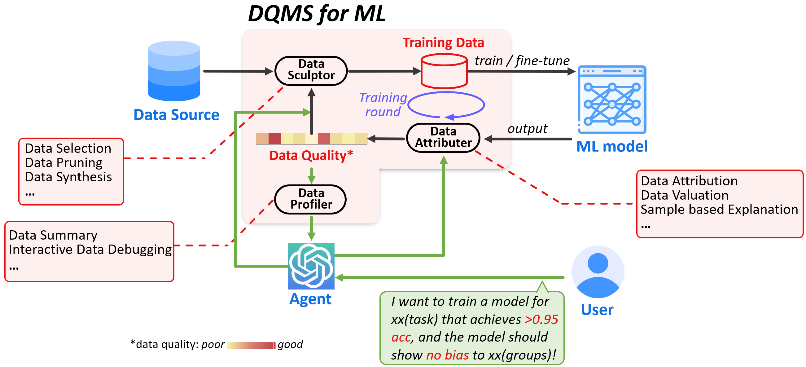

# Awesome ML Data Quality Papers

This is a list of papers about training data quality management for ML models. 

Data scientists spend ∼80% time on data preparation for an ML pipeline since the data quality issues are unknown beforehand thereby leading to iterative debugging. A good Data Quality Management System for ML (**DQMS for ML**) helps data scientists break free from the arduous process of data selection and debugging, particularly in the current era of big data and large models. Automating the management of training data quality effectively is crucial for improving the efficiency and quality of ML pipelines.

Fortunately, with the emergence and development of "**Data-Centric AI**", there has been increasing research focus on optimizing the quality of training data rather than solely concentrating on model structures and training strategies. This is the motivation behind maintaining this repository.

Before we proceed, let's define **data quality for ML**. In contrast to traditional data cleaning, training data quality for ML refers to the impact of individual or groups of data samples on the behavior of ML models for a given task. It's important to note that the behavior of the model we are concerned with goes beyond performance metrics like accuracy, recall, AUC, MSE, etc. We also consider more generalizable metrics such as model fairness, robustness and so on.

Considering the following pipeline, DQMS acts as a **middleware** between data, ML model, and user, necessitating interactions with each of them.

A DQMS for ML typically consists of three components: **Data Selector**, **Data Attributer**, and **Data Profiler**. To achieve a well-performing ML model, multiple rounds of training are often required. In this process, the DQMS needs to iteratively adjust the training data based on the results of each round of model training. The work flow of DQMS in one round of training is as followed: (a) Data Selector first acquires the training dataset from a data source and train the ML model with it. (b) After trained for one round (several epochs), Data Attributer absorbs feedback from the model and user's task requirements, and compute the data quality assessment. (c) Data Profiler then provides a user-friendly summary of the training data. (d) Meanwhile, Data Selector utilizes the data quality assessment as feedback to acquire higher-quality training data, thus initiating a new iteration.

We collect the recent influential papers about DQMS for ML, and annotate the relevant DQMS components involved in these papers, where ❶ = Data Selector, ❷ = Data Attributer, and ❸ = Data Profiler.

## 2024

- [ICLR 24] "What Data Benefits My Classifier?" Enhancing Model Performance and Interpretability through Influence-Based Data Selection [[paper](https://openreview.net/pdf?id=HE9eUQlAvo)] [[code](https://github.com/anshuman23/InfDataSel)] ❶❷
- [ICLR 24] Canonpipe: Data Debugging with Shapley Importance over Machine Learning Pipelines [[paper](https://openreview.net/pdf?id=qxGXjWxabq)] [[code](https://github.com/easeml/datascope)] ❶❷

## 2023

- [NIPS 23] Data Selection for Language Models via Importance Resampling [[paper](https://openreview.net/pdf?id=uPSQv0leAu)] [[code](https://github.com/p-lambda/dsir)] ❶
- [NIPS 23] Sample based Explanations via Generalized Representers [[paper](https://openreview.net/pdf?id=fX64q0SNfL)] ❷
- [NIPS 23] OpenDataVal: a Unified Benchmark for Data Valuation [[paper](https://openreview.net/pdf?id=eEK99egXeB)] [[code](https://opendataval.github.io/)] ❷
- [NIPS 23] Model Shapley: Equitable Model Valuation with Black-box Access ❷
- [NIPS 23] A Privacy-Friendly Approach to Data Valuation ❷
- [NIPS 23] GEX: A flexible method for approximating influence via Geometric Ensemble ❷
- [ICML 23] Discover and Cure: Concept-aware Mitigation of Spurious Correlation ❶❷
- [ICLR 23] Data Valuation Without Training of a Model ❷
- [ICLR 23] Distilling Model Failures as Directions in Latent Space ❶❸
- [VLDB 23] Equitable Data Valuation Meets the Right to Be Forgotten in Model Markets [[paper](https://www.vldb.org/pvldb/vol16/p3349-liu.pdf)] [[code](https://github.com/ZJU-DIVER/ValuationMeetsRTBF)] ❷
- [VLDB 23] Computing Rule-Based Explanations by Leveraging Counterfactuals ❸

## 2022

- [ICML 22] Measuring the Effect of Training Data on Deep Learning Predictions via Randomized Experiments ❷
- [ICML 22] Meaningfully Debugging Model Mistakes using Conceptual Counterfactual Explanations [[papeer](https://proceedings.mlr.press/v162/abid22a/abid22a.pdf)] [[code](https://github.com/mertyg/debug-mistakes-cce)] ❶❸
- [ICML 22] Datamodels: Predicting Predictions from Training Data ❷
- [SIGMOD 22] Complaint-Driven Training Data Debugging at Interactive Speeds [[paper](https://dl.acm.org/doi/pdf/10.1145/3514221.3517849)] ❷
- [SIGMOD 22] Interpretable Data-Based Explanations for Fairness Debugging [[paper](https://arxiv.org/pdf/2112.09745.pdf)] [[video](https://www.youtube.com/watch?v=bt_VL1eSu30)] ❷❸

## 2021 and before

- [NIPS 21] Explaining Latent Representations with a Corpus of Examples ❷
- [CHI 21] Data-Centric Explanations: Explaining Training Data of Machine Learning Systems to Promote Transparency [[paper](https://dl.acm.org/doi/10.1145/3411764.3445736)] ❸
- [NIPS 20] Multi-Stage Influence Function ❷
- [ICML 20]  On second-order group influence functions for black-box predictions [[paper](https://proceedings.mlr.press/v119/basu20b/basu20b.pdf)] ❷
- [SIGMOD 20] Complaint Driven Training Data Debugging for Query 2.0 [[paper](https://arxiv.org/pdf/2004.05722.pdf)] [[video](https://www.youtube.com/watch?v=qvgBmM1LP38)] ❷
- [ICML 19] Data Shapley: Equitable Valuation of Data for Machine Learning [[paper](https://proceedings.mlr.press/v97/ghorbani19c/ghorbani19c.pdf)] [[code](https://github.com/amiratag/DataShapley)] ❷
- [ICML 17] Understanding Black-box Predictions via Influence Functions [[paper](https://arxiv.org/pdf/1703.04730.pdf)] [[code](https://github.com/kohpangwei/influence-release)] ❷
- 

## Survey Papers

- [NIPS 23] DataPerf: Benchmarks for Data-Centric AI Development [[paper](https://openreview.net/pdf?id=LaFKTgrZMG)] [[code](https://github.com/MLCommons/dataperf)] ❶❷❸
- [arXiv 23] Data Management For Large Language Models: A Survey [[paper](https://arxiv.org/pdf/2312.01700.pdf)] [[code](https://github.com/ZigeW/data_management_LLM)] ❶❷
- [arXiv 23] Training Data Influence Analysis and Estimation: A Survey [[paper](https://arxiv.org/pdf/2212.04612.pdf)] [[code](https://github.com/ZaydH/influence_analysis_papers)] ❷

## Related Works

- [awesome-data-valuation](https://github.com/daviddao/awesome-data-valuation) ❷

